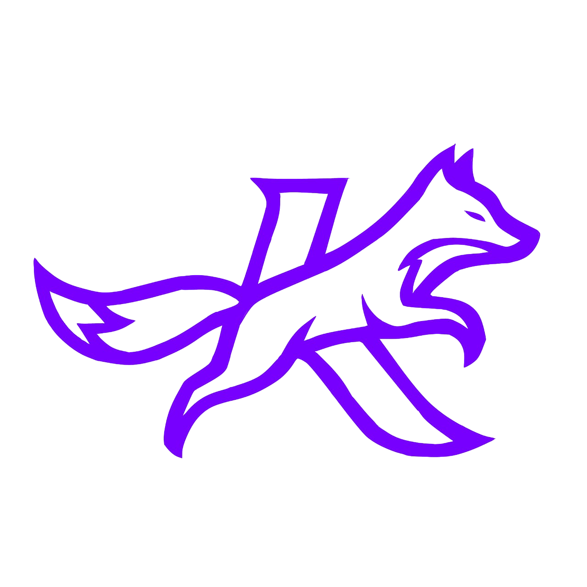

<div align="center">
  
  <h1>KonMIk Web - Reading Matchmaking & Profile Hub 🦊</h1>

  [](#)
  [](#)
  [](#)

  **[🔥 Kunjungi KonMIk Web (Segera) 🔥](#)**
</div>

<br>

**KonMIk Web (MatchingKonmik)** adalah antarmuka web modern dari ekosistem KonMIk. Dibangun menggunakan Next.js App Router terbaru, proyek ini berfokus pada fitur sosial, analitik membaca, dan pencarian kecocokan (*Matchmaking*) antar pembaca komik.

Proyek ini didesain dengan konsep UI/UX tingkat premium (*Dark Glassmorphism*) untuk memberikan kenyamanan dan estetika bagi para pecinta manga, manhwa, dan manhua.

---

## ✨ Fitur Utama

1. **Dashboard & Analitik Personal 📊**
   Lacak statistik membacamu! Lihat grafik jaring laba-laba (*Radar Chart*) yang memetakan jam kebiasaan membacamu (Pagi, Siang, Sore, Malam, Subuh), serta rangkuman total jam dan komik yang dibaca.

2. **Reading Matchmaking 💘⚔️**
   Bandingkan selera membacamu dengan pengguna lain! Algoritma Matchmaking kami (berbasis KonKon API) akan menghitung persentase kecocokan berdasarkan jam baca, komik yang sama, dan genre favorit.

3. **Sistem Hubungan (Relationships) 🤝**
   Kirim permintaan koneksi ke sesama pembaca dan pamerkan di profilmu. Terdapat 4 jenis ikatan spesial:
   - 💕 **Lovers** (Dapatkan animasi detak jantung dan *highlight* khusus di profil)
   - 🤝 **Partners**
   - 👯 **Bestie**
   - ⚔️ **Rival**

4. **Dynamic SEO (OpenGraph) 🌐**
   Bagikan profilmu ke WhatsApp, Discord, X, atau media sosial lainnya. Sistem Server Component Next.js akan memproses *preview link* secara dinamis, menampilkan *banner*, nama, dan sekilas statistik membacamu langsung dari pratinjau tautan.

5. **Premium Dark UI 🎨**
   Antarmuka cantik berbasis TailwindCSS yang menggunakan *backdrop-blur*, warna neon ungu & biru, tipografi tebal (Outfit & Inter), dan elemen interaktif.

---

## 🚀 Memulai (Getting Started)

Pastikan kamu memiliki Node.js terinstal. Proyek ini disarankan menggunakan `npm` atau `yarn`.

1. **Kloning Repositori & Masuk ke Folder**
   ```bash
   git clone https://github.com/username/MatchingKonmik.git
   cd MatchingKonmik
   ```

2. **Instalasi Dependensi**
   ```bash
   npm install
   ```

3. **Jalankan Development Server**
   ```bash
   npm run dev
   ```

4. **Buka di Browser**
   Buka [http://localhost:3000](http://localhost:3000) untuk melihat hasilnya.

---

## 🛠️ Arsitektur & Teknologi

- **Framework**: [Next.js 15+ (App Router)](https://nextjs.org/)
- **Bahasa**: [TypeScript](https://www.typescriptlang.org/)
- **Styling**: [Tailwind CSS](https://tailwindcss.com/)
- **Charts**: Custom SVG / Recharts
- **Backend/API**: Terintegrasi langsung dengan KonKon REST API (`api.konkon.id`). Menggunakan sistem otentikasi berbasis token JWT dan Header Authorization.

### Struktur Folder Utama
```text
MatchingKonmik/
├── public/                 # Aset statis (icon, images)
├── src/
│   ├── app/                # Route berbasis App Router
│   │   ├── api/            # API Route Proxy (Bypass CORS)
│   │   ├── dashboard/      # Halaman Dasbor (Analitik user)
│   │   ├── explore/        # Halaman Eksplorasi
│   │   ├── profile/        # Halaman Profil & Matchmaking
│   │   ├── layout.tsx      # Root Layout & Global Metadata
│   │   └── page.tsx        # Landing Page / Halaman Login
│   └── components/         # Komponen React Reusable (Navbar, Card, dsb)
```

---

## 🔒 Privasi & Keamanan

Semua kalkulasi fitur *Matchmaking* dilakukan dengan menghormati privasi. Pengguna yang mengaktifkan opsi "Private History" di aplikasi utama KonMIk **tidak akan** terekspos data membacanya. Radar Chart dan Skor Kecocokan hanya diproses jika kedua pihak mengizinkan datanya terlihat.

---

<div align="center">
  <sub>Dibuat dengan 💜 oleh KonMIk Team.</sub>
</div>
